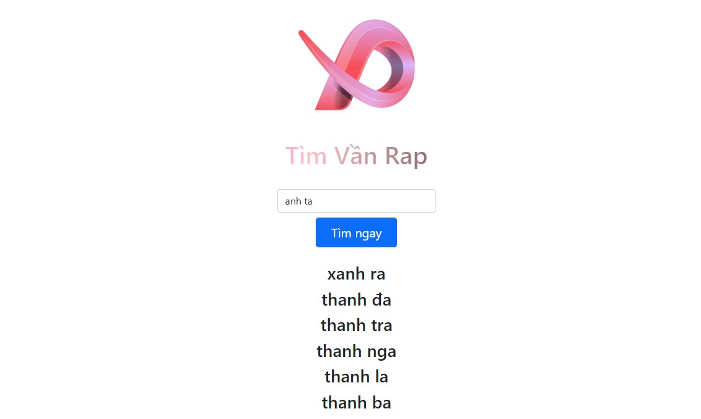

# Find Rhymes
My main objective is to help individuals with their linguistic needs, and that includes assisting rappers and musicians in finding rhyming words for their songs. With this in mind, I embarked on a project to crawl over 200,000 Vietnamese words from various sources on the internet.

The first step in this project was to extract, transform, and load the data into an Azure MYSQL database, which allowed me to organize the information and make it easier to access. I then used Flask, a web framework in Python, to build a server that would retrieve the data from the MYSQL server and process requests from users.

The server I created is capable of processing queries from users looking for rhyming words based on the input they provide. The algorithm I developed utilizes a combination of phonetic and linguistic patterns to generate a list of words that rhyme with the input provided by the user. This list is then returned to the user, who can use it to create a catchy and memorable song.

## Technology
frontend: Js. 
backend: Python, Flask, MySQL, Pandas.

## Usage
```
pip install -r "requirements.txt"
flask run
```
Server run at http://localhost:5000

## Demo


